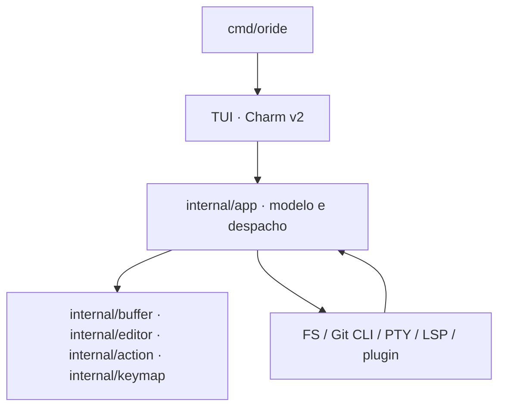

# Visão Geral de Arquitetura

## Topologia do Sistema

O projeto é estruturado em três planos concêntricos:

1. **Plano de Domínio**: regras essenciais do editor, o modelo de texto em
   `internal/buffer` (buffer indexado por linha, escrito aqui — não há rope de
   terceiros mantido em Go) e validações puras, sem dependência de terminal.
2. **Plano de Aplicação**: casos de uso, orquestração e despacho. `internal/app` é
   o **modelo único** — a TUI renderiza dele e não mantém um segundo conjunto de
   regras.
3. **Plano de Adaptadores**: PTY (`creack/pty`), sistema de arquivos, Git por
   CLI, cliente LSP stdio, e a interface TUI em **Charm v2** (`bubbletea/v2`,
   `lipgloss/v2`, `bubbles/v2`).

## Diagrama Conceitual

A direção aponta sempre **para dentro**, na direção das regras de edição
(`docs/architecture/clean-code-contract.md` §2). `app` nunca importa `tui`; as
superfícies de `tui` nunca importam `app` — apenas o composition root monta as
views, para que uma superfície possa ser substituída ou removida sem alcançar o
modelo.

## Onde cada plano mora

| Plano | Pacotes |
|---|---|
| Domínio | `internal/buffer`, `internal/editor`, `internal/action`, `internal/keymap` |
| Aplicação | `internal/app` |
| Apresentação | `internal/tui` |
| Adaptadores | `internal/fs`, `internal/git`, `internal/lsp`, `internal/plugin`, `internal/session`, `internal/term`, `internal/osutil`, `internal/config`, `internal/i18n` |
| Contratos executáveis | `internal/architecture`, `internal/docdrift` |

## Nota sobre a migração

A implementação de referência é Rust (15 crates, em `crates/`), mantida como
**oráculo de conformidade** até o fim da migração. Ela descreve a arquitetura com
`Ropey` e `Ratatui`/`Crossterm`; o produto em Go não usa nenhum dos três — daí
este documento descrever a stack real e não a herdada.

O plano de migração e o estado da paridade ficam em
`docs/migration/parity-ledger.md`.
