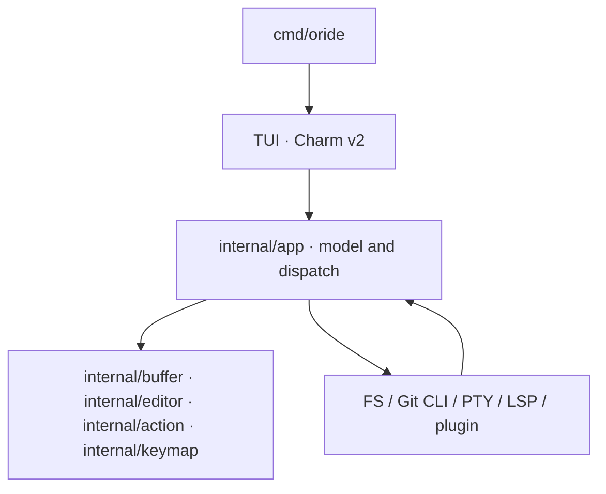

# Architecture Overview

## System Topology

The project is structured across three concentric planes:

1. **Domain Plane**: the editor's essential rules, the text model in
   `internal/buffer` (a line-indexed buffer written here — no maintained Go rope
   exists), and pure validations with no terminal dependency.
2. **Application Plane**: use cases, orchestration and dispatch. `internal/app` is
   the **single model** — the TUI renders from it and keeps no second set of rules.
3. **Adapters Plane**: PTY (`creack/pty`), filesystem, Git through the CLI, an LSP
   stdio client, and the TUI in **Charm v2** (`bubbletea/v2`, `lipgloss/v2`,
   `bubbles/v2`).

## Conceptual Diagram

Dependencies point inwards, toward the editing rules
(`docs/architecture/clean-code-contract.md` §2). `app` never imports `tui`, and the
surface packages under `tui` never import `app` — only the composition root builds
the views, so that a surface can be replaced or deleted without reaching the model.

## Where each plane lives

| Plane | Packages |
|---|---|
| Domain | `internal/buffer`, `internal/editor`, `internal/action`, `internal/keymap` |
| Application | `internal/app` |
| Presentation | `internal/tui` |
| Adapters | `internal/fs`, `internal/git`, `internal/lsp`, `internal/plugin`, `internal/session`, `internal/term`, `internal/osutil`, `internal/config`, `internal/i18n` |
| Executable contracts | `internal/architecture`, `internal/docdrift` |

## Note on the migration

The reference implementation is Rust (15 crates, under `crates/`), kept as the
**conformance oracle** until the migration ends. It describes its architecture with
`Ropey` and `Ratatui`/`Crossterm`; the Go product uses none of the three, which is
why this document describes the real stack rather than the inherited one.

The migration plan and the state of parity live in
`docs/migration/parity-ledger.md`.
